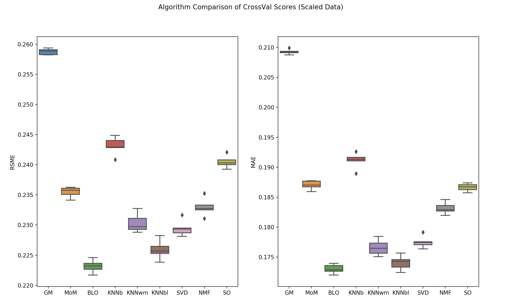
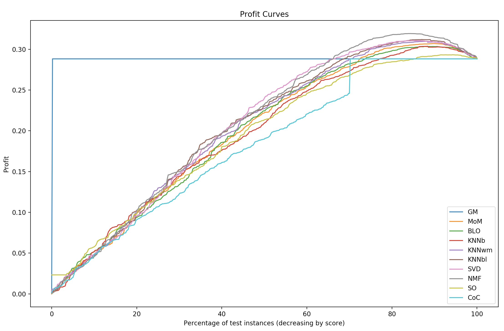
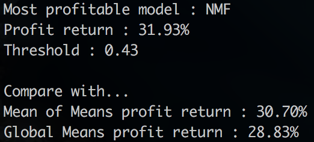

# [Your Movie Recommender App](http://ec2-52-91-161-183.compute-1.amazonaws.com:8105/)

This project was inpired by a case study that was conducted in my time at Galvanize's Data Science Immersive program. The motivation here was to build a movie recommender model that would yield the highest profit. 

## Background:
- A fictional company called Movies-Legit, uses a movie recommender to their users and although this recommender is not optimized, it has yielded the company a significant revenue stream so their management is hesitent to change it but they want to explore any possible optimized solutions.

- Currently Movies-Legit recommender uses what's called a 'mean-of-means'. How 'mean-of-means' works is that future un-seen movie ratings for a user are predicted by getting the mean of:

a) the rating for a particular movie accross users
b) the mean of all the particular user's ratings
c) the average overall rating of all ratings for everymovie by every user

Hence the "mean" of Means name.

- Ultimate Goal: Tie back revenue to the performance of the movie recommender and find a recommender that yeilds the highest profit. Hopefully this optimized recommender yeilds a higher profit than Movies-Legit's current mean-of-means recommender.

## Step 1: Gather prediction accuracy scores of other models vs. the current Mean-of-Means model.
### Error Metrics explained:
- These recommenders are predicting the ratings a user would give a movie that he/she has not yet seen. This is a regression problem, therefore we'll use score metrics of RMSE (Root Mean Squared Error) and MAE (Mean Absolute Error). MAE is literally the average absolute error between the model's predicted movie rating and the true rating that a user gave a movie. RMSE is similar but it gives extra error penalties when the difference between the predicted movie rating and the true rating value is large since it squares this difference. RMSE is more conservative so we'll pay special attention to this metric.

### Scaling ratings data:
- Before we test our models, we'll want to scale all the rating data. What this means is you're re-scaling the ratings a user gives from the 0.5-5 range to a 0-1 range. The reason for this is that many users rate movies differently. Some users will rate movies always on the lower end, perhaps from 0.5 - 3, while others will always rate movies from 3.5-5. In otherwords, one user's .5 rating is equivalent to another user's 3.5 rating (as an example). To make sure all user's ratings are on the same scale, we do what's called data scaling where we'll spread a given users' previous ratings on a 0-1 scale so we can evenly compare users ratings.

### Results:

- The take aways here, almost every model has a better score (lower RMSE & MAE) than the MoM (Mean-of-Means) recommender.
- BLO (Baseline Only) model had the best RMSE & MAE score.

The abreviations are as follows:
- GM (Global Mean)
- MoM (Mean of Means)
- BLO (Baseline Only)
- KNNb (KNN Basic)
- KNNwm (KNN With Means)
- KNNbl (KNN Baseline)
- SVD (Singular Value Decomposition)
- NMF (Non-negative Matrix Factorization)
- SO (CoClustering)

## Step 2: Use Profit curves to find our best model.
- Even though we now have the accuracy scores of these models, the ultimate goal is the choose a model which yields Movies-Legit the most profit. We can do this with what's called a profit curve.

### How we use the movie recommender in a business setting:
- Every time a movie rating prediction for a given user is over a certain threshold (say 0.5, remember we scaled the ratings data from 0-1) then we'll recommend this movie to the user.
- If we recommend a movie to a user that the user actually does like, this is a True-Positive.
- If we recommend a movie to a user that the user doesn't like, like is called a False-Positive.

### Make business assumptions
- To build a profit curve, we'll need to first define what exactly a True-Positive and False-Positive means to the company.
#### Here we'll make some assumptions:
1. users pay a monthly subscription of $10/mo to use Movie-Legit's movie service.
2. 1 out of every 20 users will renew their monthly subscription if they receive a movie recommendation they like (a True-Positive). 1 TP (True-Positive) = $10 * (1/20) = $0.50
3. 1 out of every 20 users will end their monthly subscription if they recieve a movie recommendation they don't like (a False-Positive). 1 FP (False-Positive) = $10 * (1/20) = -$0.50

#### Next the profit curve.
- Now that have defined what a TP and FP mean to the business, we want to choose and model and a threshold for that model that gives the most profitable combination of TPs and FPs.
- We can compare all a model's predictions against the real historical ratings users gave. Next we look at each threshold from 0-1 (where any prediction above the threshold is recommended to the user). Last we quantify the amount of TPs and FP by looking at whether a user actually liked the movie that was recommended. We can then plot all the models we're testing with all the threshold values to understand what model and threshold is most profitable given our business assumptions.

### Results:

Interestingly enough, even though the BLO (Baseline Only) model had the best score metric, when we make quanitify what TPs and FPs mean to the business, the NMF (Non-negative Matrix Factorization) model comes out to be the most profitable at a threshold of 0.43.

Here's how the NMF compares against the current Mean of Means solution:

- So it works out that given our assumptions, the NMF at a threshold of 0.43 has 1.23% higher profit return than the current Mean-of-Means solution.
- Depending on how many customers Movies-Legit serves, a 1.23% profit increase could be substantial and switching from the mean-of-means to NMF model would be a smart business move.

# The Web-App: Seeing is Believing
- Although this case study is interesting, the real point to this project is the build an actual movie recommender.
- I'm happy to say that this thing actually does provide decent recommendations. I have pretty particuar movie tastes and I've already found a handful of awesome movies I never knew existed!
Give it a whirl for yourself and enjoy!

[**WEB APP**](http://ec2-52-91-161-183.compute-1.amazonaws.com:8105/)

